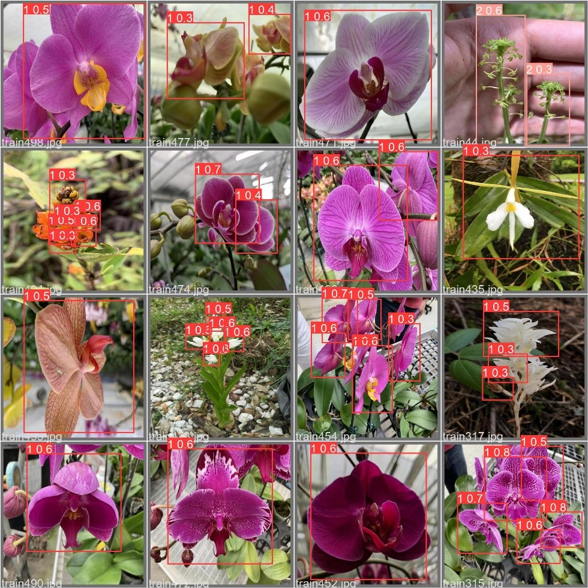

## TBrain Orchid-Species-Identification-&-Classification-Competition
The competition on the TBrain platform involves using artificial intelligence, machine learning, and deep learning to train high-accuracy orchid image recognition models.  

## Preparation

1. Use [YOLOv5](https://github.com/ultralytics/yolov5) to extract three bounding boxes from each training image.
2. Train the model using the segmented training images.
3. Upon receiving public data and private data, first use [YOLOv5](https://github.com/ultralytics/yolov5) to extract a bounding box from each image. 
4. Then use each trained model to predict the category.
5. Finally, use the three CSV files predicted by the three trained models to perform weighted averaging.

## Code Description

- **train_SPM.py & train_FH.py**:  
  Two different methods for training models and making predictions

- **data_loader.py**:  
  Read and organize all the provided official data.

- **Image_Search_Crawler.py**:  
  Crawl images from the web using image search.
  
- **transpose.py**:  
  Data augmentation methods.